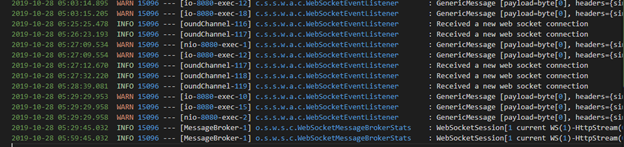
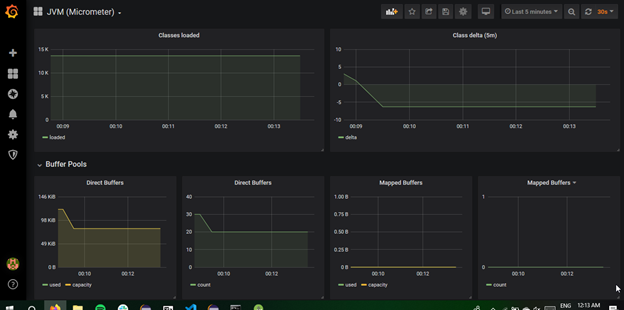

[[Application Architecture]{.underline}](#application-architecture)

> [[STOMP (Protocol of Choice):]{.underline}](#stomp-protocol-of-choice)
>
> [[Why Websocket?]{.underline}](#why-websocket)
>
> [[Why STOMP?]{.underline}](#why-stomp)
>
> [[Message Broker Structure]{.underline}](#message-broker-structure)
>
> [[Why are you not using a message broker like RabbitMQ /
> ActiveMQ?]{.underline}](#why-are-you-not-using-a-message-broker-like-rabbitmq-activemq)
>
> [[Flow of activity:]{.underline}](#flow-of-activity)

[[System Monitoring and Configuration using
Prometheus]{.underline}](#system-monitoring-and-configuration-using-prometheus)

> [[Custom Logging through
> Log4j]{.underline}](#custom-logging-through-log4j)
>
> [[Using Grafana and Prometheus for Logging and Metrics
> Visualization]{.underline}](#_yeyq9nptm9xj)
>
> [[Sample Screenshots of Grafana
> Dashboards]{.underline}](#sample-screenshots-of-grafana-dashboards)
>
> [[Amazon CloudWatch]{.underline}](#amazon-cloudwatch)

[[Redundancy and Scalability]{.underline}](#redundancy-and-scalability)

Application Architecture
========================

Backend Technologies:

-   SpringBoot 2.0 with Java8

-   MySQL for persisting our chat messages and users

-   Server hosted on Amazon EBS

-   Amazon S3 for File Storage

Front End Technologies:

-   Mobile Application built on Android Studio

-   A small web client with HTML/CSS/JS (optional)

STOMP (Protocol of Choice):{width="4.229166666666667in" height="2.7096609798775155in"}
--------------------------------------------------------------------------------------------------------------

We have used STOMP (Stream Text-Oriented Messaging ProtocoL) for
communication between the client and the server. STOMP defines a
protocol for client/server to communicate using messaging semantics. The
semantics are on top of the WebSockets and defines frames that are
mapped onto WebSockets frames. WebSocket built on the TCP/IP stack
upgrades your HTTP connection which is then used by a WebSocket.

### Why Websocket?

Our use-case was to build a chat application which traditionally relies
on an event-driven response structure, rather than using a long-polling
strategy in which periodically get responses we retrieve messages only
when there is data available to be read. The only way to obtain close to
real-time feedback is through using technologies like Websocket. To sum
it up we wanted our chat app to have *low latency, a full duplex
communication*, *and a continuous connection maintained between client
and server*.

### Why STOMP?

The WebSocket protocol unfortunately deals with data on a low level byte
stream, while this is good for data transfer we lose out on semantic
meanings on text-based transfers such as messages exchanged between
clients need to be converted to text before further processing can take
place. Also STOMP, provides a variety of frame types which can be easily
mapped to our chat app such as: *CONNECT, SUBSCRIBE, UNSUBSCRIBE, ACK,
or SEN*

Message Broker Structure
------------------------

{width="6.5in" height="2.638888888888889in"}

For our Message endpoints we have the following paths available:

-   */app/chat.register :* For signing up and subscribing to the message
    > broker

-   */app/chat.send-private:* For handling private message retrieval

-   */app/chat.send-public:* For handling public message retrieval

-   */app/topic/public :* Subscribing for public group chat messages

-   */app/topic/private* : Subscribing for private chat messages

For our REST Client we have some designated url for user validation and
retrieval of past messages (if client wasn't subscribed to the message
broker by then)

-   /user/username?= (GET User associated with username),
    > /user/checkPassword (Check password credentials sent by POST,
    > /chatMessages/public (GET previous chat messages that the client
    > might have missed)

Why are you not using a message broker like RabbitMQ / ActiveMQ?
----------------------------------------------------------------

Currently our architecture uses the out-of-the-box solution provided by
Spring's internal message broker. However, once this application goes
into full production and starts dealing with a high number of requests
we might need to a full-fledge messaged broker such as those provided by
RabbitMQ and ActiveMQ. The good thing is that Spring provides us easy
interoperability between these brokens and with a few lines of code we
can transfer to them without much hassle once the need arises.

Flow of activity:{width="3.901042213473316in" height="2.4397189413823273in"}
----------------------------------------------------------------------------------------------------

1.  When a user creates an account, the username and password get saved
    > in a MySQL database. During login, the details are checked against
    > the already saved records, and if there is a match, the user is
    > logged in and can proceed to the next activity.

2.  There are two tabbed activities: one which allows one-on-one chat
    > between users; while the other one allows the users to join a
    > global chat-room and communicate with each other. There is further
    > possibility of channels (to further limit public group access)
    > that were not fully implemented due to time constraints.

3.  When a person initiates a chat with a person with whom they have
    > chatted before, the messages are retrieved and populated in the
    > Android ListView and further messages are received on an
    > event-driven basis.

4.  The client can also send files to its receiver. The list of files
    > transferred, images sent etc is maintained in S3. When a file is
    > sent, it's uploaded to S3 and a URL is generated at completion and
    > sent to the group/private chat depending on where the file was
    > sent from. Anyone can click on the link to download the file. The
    > URL itself is pre-signed with appropriate access level to allow
    > downloads and will expire after a set time period, which is
    > currently set to 24 hours.

System Monitoring and Configuration using Prometheus
====================================================

Custom Logging through Log4j
----------------------------

Currently all the logs are being displayed at console when in
development, while in Ngnix server at Elasticbeanstalk they are stored
in /web directory.

Logging levels we can use for debugging purposes:

· *INFO:* Received New Socket Connection

· *WARN:* Response of not right format

· *ERROR:* Socket Timeout Exception from Server

· *FATAL:* ApplicationContext closes, DB Shutdown

Custom Logging through Log4j

Currently all the logs are being displayed at console when in
development, while in Ngnix server at Elasticbeanstalk they are stored
in /web directory.

Logging levels we can use for debugging purposes:

· *INFO:* Received New Socket Connection

· *WARN:* Response of not right format

· *ERROR:* Socket Timeout Exception from Server

· *FATAL:* ApplicationContext closes, DB Shutdown

{width="6.5in" height="1.53125in"}

Using Grafana and Prometheus for Logging and Metrics Visualization
------------------------------------------------------------------

{width="4.6875in" height="1.0625in"} 
------------------------------------------------------------

Sample Screenshots of Grafana Dashboards
----------------------------------------

{width="6.5in" height="2.9479166666666665in"}

{width="6.5in"
height="3.2291666666666665in"}{width="6.5in"
height="3.1145833333333335in"}

Amazon CloudWatch
-----------------

We also have AWS EBS built-in CloudWatch support for real-time logging:

{width="6.5in" height="3.6944444444444446in"}

Redundancy and Scalability 
===========================

-   AWS has a built in load balancer and uses Auto-Scaling for creating
    > new instances at peak usages for example when it detects high
    > amount of connections made to socket it can horizontally scale
    > automatically

> {width="6.5in" height="3.9027777777777777in"}

-   For better performance we can employ a caching strategy for fast
    > data fetching as well.

<!-- -->

-   Since our interactions with the client does employ a REST-like
    > interface thus there are not 'sticky sessions' as no particular
    > data is associated with a client for example session ids, cookies,
    > etc. Each rest call is independent and no client requires a
    > particular instance of a server

-   Currently our embedded DB is a MySQL database, if it grows we can
    > employ techniques like Sharding for better performance.
