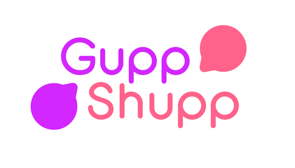
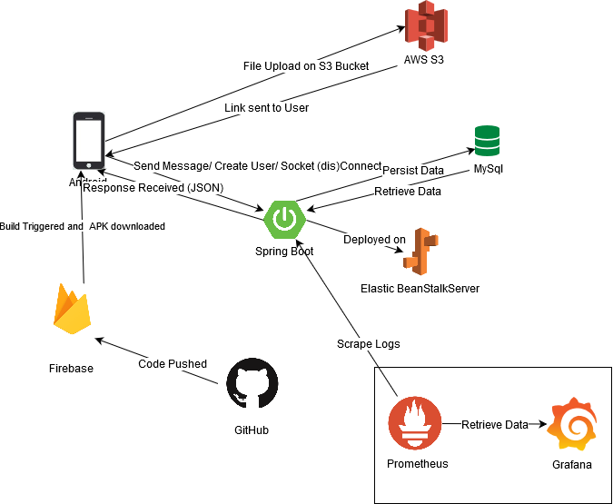
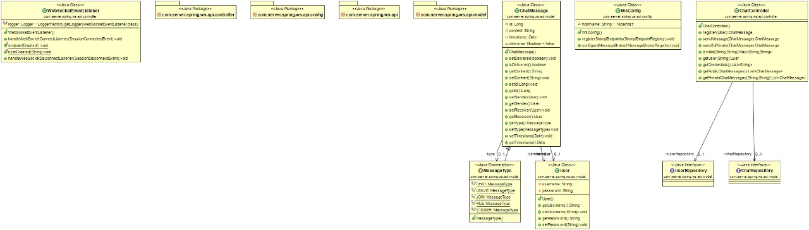
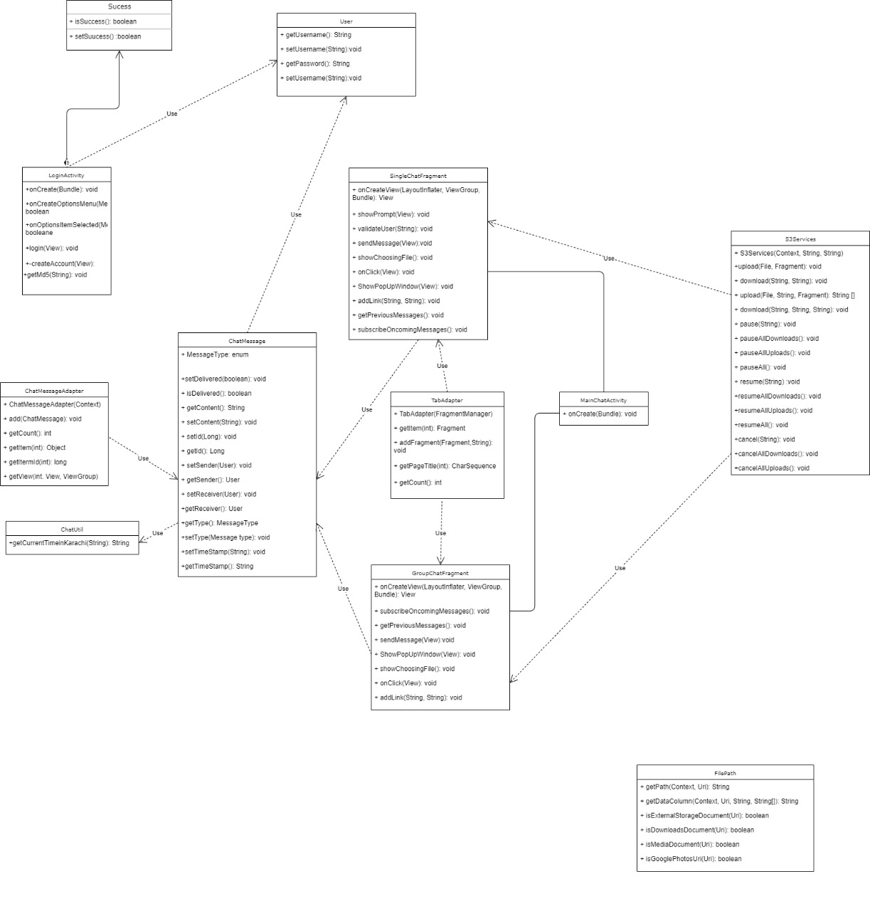

# *Guppshupp* Chat Application



## Getting Started

### Prerequisites

Following are the prerequisites of the application:

- Android Studio with SDK
- Java JDK 8.0 or above installed
- Grafana installed on your system running on port 5000
- AWS IAM credentials access for cloud
- MySQL with port 8000

### Installing

### Required IDE(s)

This application was developed with the following IDEs:

- Backend: Spring Boot built using Spring Tool Suite (Eclipse)

- Frontend: Android Studio

- Monitoring: Grafana and Prometheus (running locally)

  However, for Backend you are to free to use any IDE you wish as long as you have Maven and Git installed in your system.

## Deployment

The application is currently deployed on Elastic Beanstalk. To deploy it on your local server make sure your port 8080 is active and to extract the war file use this command:

```
mvn clean package
```

Run the Android version with your Emulator of choice

## Diagrams






## Versioning

Currently at Version 1.0.0 (Beta Release)

## License

This Application has been licensed under 

[Apache 2.0]: LICENSE.md	"Apache License"

## Acknowledgements

- [Flaticon]: www.flaticon.com	"Flaticon for the usage of icons in our application"

- [NaikSoftware]: www.github.com/NaikSoftware/StompProtocolAndroid	"We used NaikSoftware's Stomp Protocol Client Starter code  for communicating with Android to the Server "

- [Android Filepicker]: www.github.com/Angads25/android-filepicker	"Android Filepicker by Angads25"


## See Also

- [Application Architecture]: /Application_Architecture.md	"Application Architecture Report"
